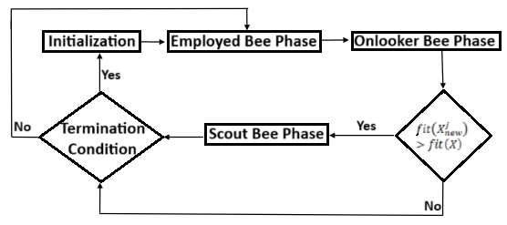
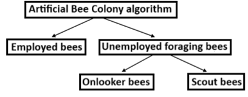

# ABC Algorithm Notes

## Flowchart
<p align="center">
  
</p>


## ABC Overview
- **Food Source**:
  - Represents the solution to the problem, evaluated using the objective function.

## Algorithm Structure
<p align="center">
  
</p>

### 1. Employed Bees
- Exploit food sources and share information about distance, profitability, and direction.
- Aim to find better food sources and create new solutions.

### 2. Unemployed Foraging Bees
#### 2.1. Onlooker Bees
- Watch the waggle dance and choose food sources based on nectar amount probabilities.
- Generate new solutions using a greedy selection method.

#### 2.2. Scout Bees
- Search around the nest spontaneously.
- Abandon exhausted food sources and generate new solutions as needed.

## Bee Options After Nectar Collection
- Stop collecting and become an uncommitted follower.
- Dance to recruit others and return to a specific food source.
- Simply return to the food source.

## Fitness Calculation
- Formula: ` fit(X) = { 1 / (1 + f(x)) if f(x) ≥ 0 || 1 / (1 + |f(x)|) if f(x) < 0 } `
where `f(x)` is the objective function value.

## Trial Counter
- Tracks the number of failures encountered by each solution.
- Increased if a new solution is of low quality.
- Reset to zero if a better solution is found.

## Employed Bees Phase
- Generate a new solution for each food source. The number of employed bees should match the number of food sources.
- A partner solution `X_p^j` is randomly selected to ensure it differs from the current solution.
- New solution formula: `X_new_j = X_j + ϕ × (X_j - X_p_j)` where `ϕ` is a random value in the range [-1, 1], and `bound(X_new_j)` ensures the solution remains within bounds.
- **Greedy Selection**: If `fit(X_new_j) > fit(X_j)`, then `X = X_new_j`.

## Onlooker Bee Phase
- **Probability Calculation**:
- Formula:
  ```
  Prob_i = 0.9 × (fit(X) / Max fit(X)) + 0.1
  ```
  where `Prob_i` is the probability of each solution, and solutions with higher fitness receive higher probabilities.

## Scout Bee Phase
- Identify food sources `K` where the trial counter exceeds a predefined limit.
- Randomly replace the solution `X_new^j` associated with the identified food source.
- Evaluate the fitness of the new solution.
- The ABC algorithm memorizes the best solution obtained before executing the scout bee phase.

## Artificial Bee Colony Algorithm

### Steps
1. **Initialization**: Set up initial parameters and food sources.
2. **Employed Bees Phase**: Generate new solutions for each food source.
3. **Onlooker Bees Phase**: Calculate probabilities and generate new solutions based on the fitness.
4. **Scout Bees Phase**: Identify exhausted food sources and generate new solutions.
5. **Termination Condition**: Check if a stopping criterion is met.
6. **Solution Retrieval**: The best solution found by the bees is considered the final output.

## Applications
- Continuous optimization problems
- Benchmark functions in optimization
- Engineering design problems

## Troubleshooting
- Ensure proper initialization of parameters and food sources.
- Verify the implementation of fitness calculation and solution generation.
- Monitor the trial counter to avoid premature abandonment of good solutions.

## References
- Research papers and literature on ABC for further understanding and variations of the algorithm.


